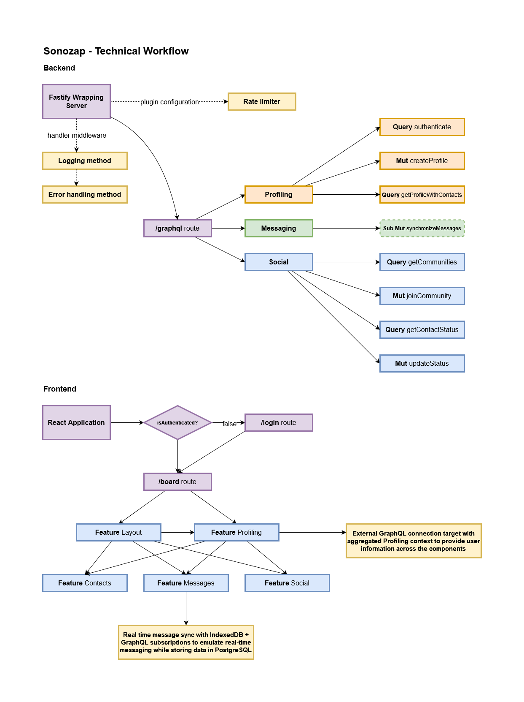

#  Sonozap
Sonozap is a fully-featured Whatsapp clone with real-time messaging, contacts management and authentication built on top of React and Relay. The project works with [Relay](https://relay.dev/) and [Mercurius](https://github.com/mercurius-js/mercurius) as both client and server providers for GraphQL and [Drizzle](https://orm.drizzle.team/) as relational ORM to handle data persistance with PGSQL. 

# Getting started

### Executing the application

- There are some requirements before executing the project:
    - [NodeJS](https://nodejs.org/en)
    - [pnpm](https://pnpm.io/pt/)
    - [Turborepo](https://turbo.build/)
    - [Docker](https://www.docker.com/) (docker-compose)
    - [Relay VSCode extension](https://marketplace.visualstudio.com/items?itemName=meta.relay) (optional)
    - [GraphQL VSCode extension](https://marketplace.visualstudio.com/items?itemName=GraphQL.vscode-graphql) (optional)

- A `.env` file in the project root is necessary in order to execute it. You can rename the pre-existing file `.env.example` file to `.env` and execute directly without problems.
- After meeting all the requirements, run the command:
    ```
    npx turbo run dev
    ```

### Executing the migrations

Currently, the migration process is being executed manually, this will change in the future. For now, there is need to access the self-hosted docker pgadmin instance (http://localhost:5050/browser/) and manually create the tables. The global schema can be accessed [here](./apps/backend/src/features/database/schema.ts).

# Stack

Sonozap works with GraphQL, functioning with standard queries and mutations to provide a basic interface for features like contacts management and social media interactions and websocket-based queries and mutations to provide real-time chat with subscriptions. 

The project is **currently** divided in three different packages: **backend** - where the business logic and connection to the database is implemented, **frontend** - where the React ui is located and **local-infra** which is focused on providing local development infrastructure (currently a PostgreSQL and a pgadmin containers).

The development arrangement selected for this project was monorepo and to achieve that, the tool [Turborepo](https://turbo.build/) was used to mount the pipelines and organize the packages. This project can be easily expanded even to have entire features located in separated microservices from the monolithic backend that can or can not point to a new PostgreSQL instance.

# Architecture

> Note: This project is in constant evolution and the architecture section may be updated based on changes that may happen to the code, this includes: feature additions or deletions, schema changes, database changes and others.

When written, this project's architecture was developed to provide a very simple CRUD-application with an integrated real-time feature, but at the same time be easily expandable. Between the selected design patterns for that project, one of the most important ones was **folder by feature**, that implementation provided a clear path to where the logic should be located and what is needed to finish each isolated feature without having impact (or at least having low impact) in other features, avoiding that a single problem inside a component can cause an application entire breakdown.

### Frontend

<div>


In the frontend application each folder in the features folder is representing a single, isolated feature that apply their own business rules. The folder can contain components and usual logic (like contexts and separated methods). It may not map to the backend ones since one backend feature, for example, can be divided into more or the contrary.

</div>
<br>

### Backend

<div>


In the backend application each folder in the features folder is representing a single feature that apply their own business rules. The folder usually contains logic that will be futurely applied to the resolvers directly and validation models .

</div>

<br>

### Overall structure diagram

The overall structure diagram provides an easy-to-understand view of the current applications running in this project, the objective is to understand, visually, how the parts are connected and the meaning behind the workflow processes.


